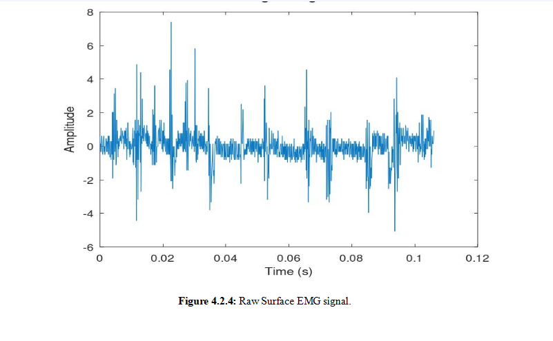
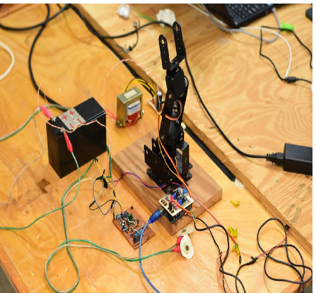

# sEMG-Controlled Robotic Arm Prototype

A robotic arm prototype controlled by surface electromyographic 
(sEMG) signals, built during a research attachment at the Centre 
for Robotics and Biomedical Engineering, Dedan Kimathi University 
of Technology.

## Overview

The goal was to demonstrate that muscle contractions could 
directly drive robotic movement in real time. Rather than a 
full robotic arm, the prototype consisted of a mechanical 
structure mimicking the upper arm and elbow joint — when I 
flexed my arm, the joint moved up. Simple, but it worked.

This kind of proof of concept is foundational to prosthetic 
and rehabilitation device development, where intuitive 
body-driven control is the goal.

## How It Works

1. Surface EMG electrodes placed on the forearm capture 
   muscle contraction signals when the arm flexes
2. Raw signals are filtered to remove noise
3. Processed signals are classified using an SVM model
4. Classification output triggers movement in the mechanical 
   elbow joint via Arduino

## Tech Stack

- **Signal Processing:** MATLAB, Python (Matplotlib), NI DAQ
- **Classification:** Python (scikit-learn, SVM)
- **Hardware Control:** Arduino, C++
- **Sensors:** Surface EMG electrodes

## System Architecture

Muscle Flex → EMG Sensor → Noise Filtering → 
SVM Classification → Arduino → Joint Movement

## Key Challenge

Noise filtering was the hardest part. EMG signals pick up 
a lot of interference and getting clean enough signal to 
reliably trigger movement required significant work on the 
filtering pipeline. Solving this was what made real-time 
response possible.

## Results
Successfully built a working prototype that translates a 
forearm flex into mechanical elbow movement in real time. 
Shared at ISACT 2024 Conference in Naples 

## What I Learned

- Biosignal circuit design and acquisition
- EMG signal processing and noise filtering
- SVM classification for real-time control
- Python and C++ for hardware interfacing
- Building and troubleshooting at the hardware/software boundary

